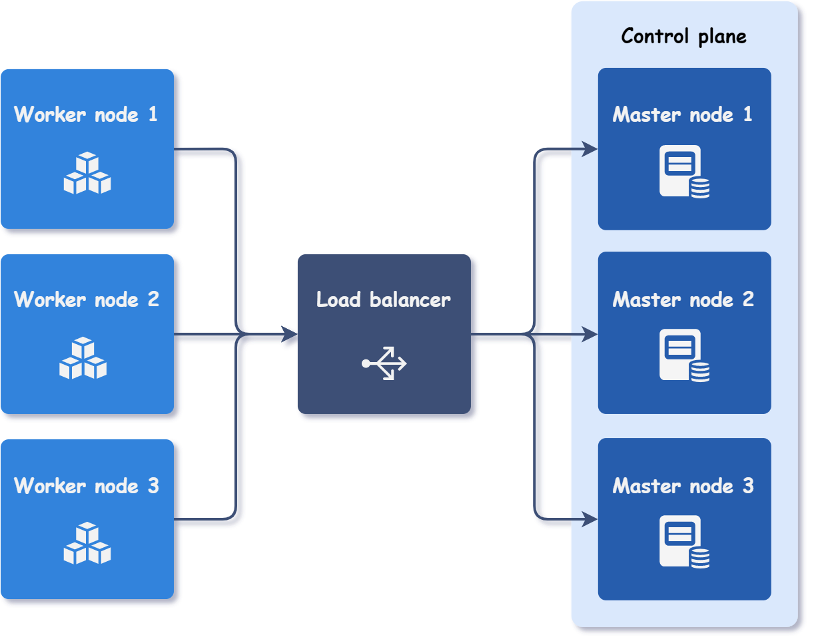

# Kubernetes High Availability: The Complete Guide

This repository contains supporting materials and architectural diagrams for the comprehensive guide on setting up High Availability Kubernetes clusters.

## 📕 About the Guide

Setting up a truly HA Kubernetes cluster is often seen as a "dark art". Documentation is scattered, and one wrong step in the control plane can lead to disaster.

This guide is designed to save you hours of trial and error, providing a clear, step-by-step path to a resilient production environment.

### What you will learn:
* **Architecture Design:** Designing a resilient control plane.
* **Step-by-Step Configuration:** Setting up HAProxy, Keepalived, and etcd.
* **Cluster Bootstrapping:** Safe and secure installation.
* **Best Practices & Troubleshooting:** Real-world scenarios.

### What this architecture solves:
* **Control Plane Redundancy:** No more single point of failure.
* **Etcd Quorum:** Proper 3-node configuration for state consistency.
* **API Load Balancing:** Seamless failover for `kubectl` and worker nodes.

---

### Why this guide?
I spent hours debugging `etcd` timeouts and certificate mismatches. I wrote this guide to be the resource I wish I had—practical, command-based, and tested in production.

---

## 🚀 Get the Full Guide

Ready to build a resilient cluster? Get the complete PDF guide, including all scripts and diagrams:

👉 **[Download the Guide on Gumroad](https://blanestar.gumroad.com/l/kubernetes-ha-guide)**

---

## 🛠️ Included Diagrams

*Figure 1: Kubernetes HA Architecture*

---

## 🤝 Feedback

If you find this useful, or have any questions, feel free to reach out!
